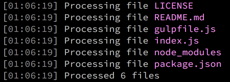
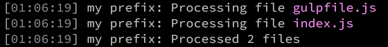
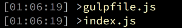
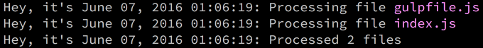
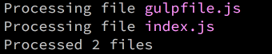
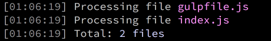

# gulp-spy [](https://travis-ci.org/dcwarwick/gulp-spy)

> Log the contents of [vinyl](https://github.com/wearefractal/vinyl)
file streams so you can see what files run through
your gulp pipeline.



A log message is written to the console for each file in the stream,
and a summary message is optionally written to the console showing the
number of files that passed through when the stream is finally flushed.


## Install

```
$ npm install --save-dev gulp-spy
```


## Usage

```js
var gulp = require('gulp'),
    spy = require('gulp-spy');

gulp.task('default', function() {
  return gulp.src('*')
    .pipe(spy())
    .pipe(gulp.dest('dist'));
});
```


## API


### spy(opts)

`opts` should be an object with some or all of the following fields, or
may be omitted to accept the defaults.


### Common options

#### prefix

Type: `string`  
Default: `false`

Optionally supply a string which will be displayed at the start of each
log message and summary message. When there are multiple gulp tasks
running in parallel, this can help clarify which log messages come
from which streams. A falsy value means no prefix is used.

```js
    .pipe(spy({
      prefix: 'my prefix:'
    }))
```



#### postfix

Type: `string`  
Default: `false`

Optionally supply a string which will be displayed at the end of each log
message and summary message. A falsy value means no postfix is used.

```js
    .pipe(spy({
      postfix: 'with this postfix'
    }))
```


#### count

Type: `boolean`  
Default: `true`

Turn off count mode to stop logging of the summary which shows the number
of files that passed through when the stream is finally flushed.

#### log

Type: `boolean`  
Default: `true`

Turn off log mode to stop all logging of files and of the summary. This
can be useful to enable conditional logging in gulp tasks. With ```log```
set to ```false``` the gulp-spy pipeline operation becomes a no-op.


### Advanced options

#### console

Type: `Console`  
Default: `console`

The console to be used for logging. By default, the system console is used,
which writes the output to `process.stdout`. An alternative console can be
used to redirect the output to a different output stream.

```js
    .pipe(spy({
      console: new console.Console(getLogOutputStream())
    }))
```

#### format

Type: `string`  
Default: `'Processing file %s'`

Set a string value to override the format of the log message for each file
in the stream. `%s` will be replaced with the relative path and name of
the file. If there is no `%s` in the string the relative path and name
of the file will be appended. A falsy value means the individual files
are not logged (but they are still counted, so a summary log message
may still be displayed).

```js
    .pipe(spy({
      format: '>' + chalk.yellow('%s')
    }))
```



#### timestamp

Type: `string`  
Default: `[%H:%M:%S]`

Set a string value to override the format of the timestamp shown at the
start of each log line. The default format matches the timestamps used
by gulp's own log output. Format specifiers supported by
[strftime](https://www.npmjs.com/package/strftime) can be included.
[chalk](https://www.npmjs.com/package/chalk)
can be used to add color and style if supported by the console. A falsy
value means no timestamp is shown.

```js
    .pipe(spy({
      timestamp: 'Hey, it\'s %B %d, %Y %H:%M:%S >'
    }))
```



```js
    .pipe(spy({
      timestamp: false
    }))
```



#### many-format

Type: `string`  
Default: `'Processed %d files'`

Set a string value to override the format of the summary message written
to the console when more than one file passed through the stream. A falsy
value means that no summary message will be written in the case when more
than one file passed through the stream. `%d` will be replaced with the
number of files that passed through the stream. If there is no `%d` in
the string the number of files that passed through the stream will be
appended. A falsy value means that no summary message will be written
in the case when more than one file passed through the stream.

```js
    .pipe(spy({
      'many-format': 'Total: ' + chalk.cyan('%s files')
    }))
```



#### one-format

Type: `string`  
Default: `'Processed 1 file'`

Set a string value to override the format of the summary message written
to the console when exactly one file passed through the stream. A falsy
value means that no summary message will be written in the case when
exactly one file passed through the stream.

```js
    .pipe(spy({
      'one-format': 'Total: ' + chalk.cyan('1 file')
    }))
```


#### zero-format

Type: `string`  
Default: `'No files processed'`

Set a string value to override the format of the summary message written
to the console when no files passed through the stream. A falsy value
means that no summary message will be written in the case when no files
passed through the stream.

```js
    .pipe(spy({
      'zero-format': 'No files matched'
    }))
```


#### date

Type: `Date`  
Default: false

Supply a date object which will be used for all timestamps. This is really
only used for test purposes where repeatable output is desired, as it makes
the timestamps themselves rather pointless.


## License

MIT © [Dave Clark](http://github.com/dcwarwick)
